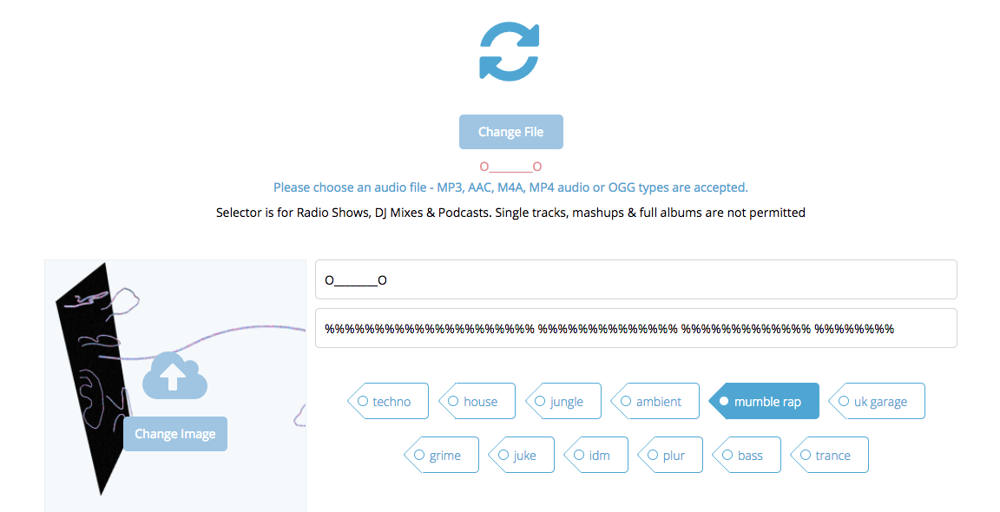
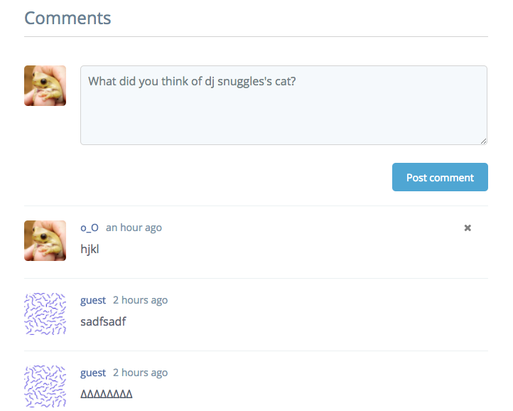
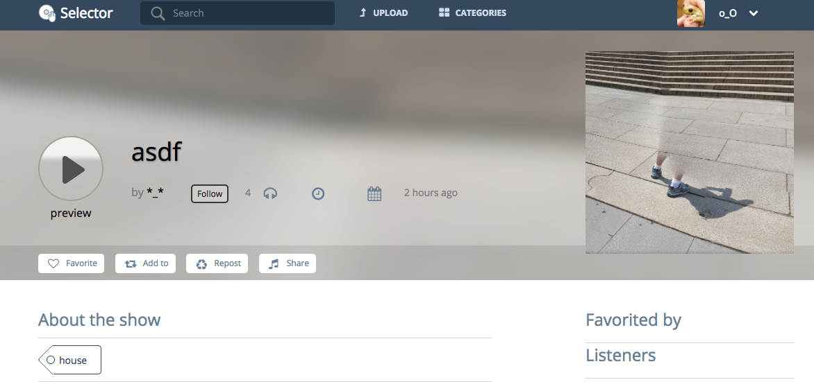
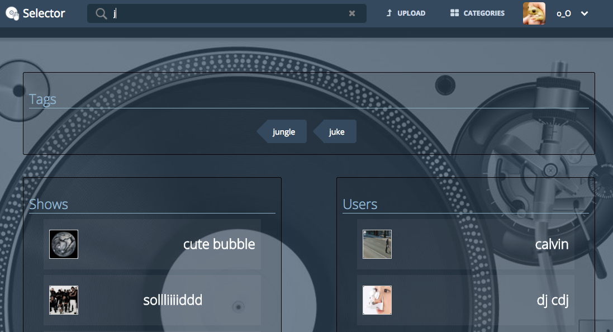

# Selector

[Live]: https://selectorapp.herokuapp.com/#/

Selector is a web application inspired by MixCloud built using Ruby on Rails and React/Redux.

## Features & Implementation

### Show CRUD

Shows are stored in a db table with columns including "audio_url", "title",
"description" and "image". Upon login, users can create, render, edit and remove shows.
Shows can be displayed on the main feed and in various filtered feeds throughout the site.
In addition, a show also has its own profile page to display stats and links to
the author, listeners, and tags. Users can comment on a shows profile. If the current user
is the author of the show, they will have links displayed to delete or redirect to the
show's edit page.

### Show Playback

Shows can be played from the profile page or any feed. Playback has controls for
play, pause, scrub/seek, and volume. Once a show is played it will display in the
bottom player footer. The user can navigate to anywhere on the site without
interrupting play. When a new show is played, the previous unfinished listens will
move back in the queue. The "next" dropdown will display these shows. When a
show is finished it leaves the queue and the next show will start playing.

### Show Preview

Shows can be previewed by hovering over the play button in the show preview,
show feeds, or playback footer. The preview will play 5 seconds from
4 different positions of the show. If the play button is clicked at anytime
during playback, the preview will stop and the show will begin playing in the
playback. Preview is disabled during playback.

### User Profiles

Users can create and edit their own profile pages. Display includes a feed of all
shows by the user. On the header nav next to the user display there is a dropdown
with a link to a settings page for editing the profile. Also the button
"Update cover image" will redirect to settings.

### Search

By clicking on the search input on the header nav, users can search tags,
shows, and users. Search is updated on each change of key, and will render
for each field.

